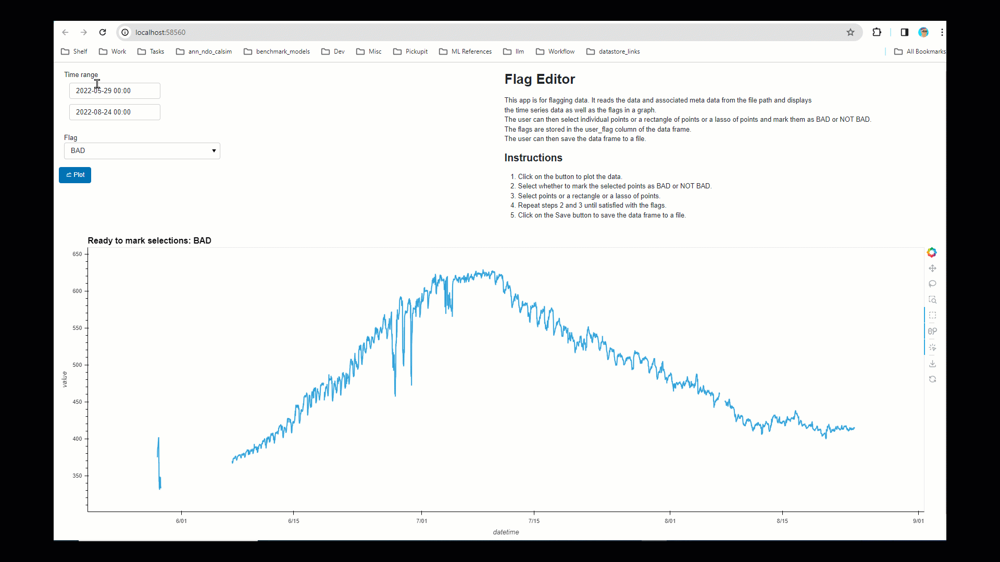
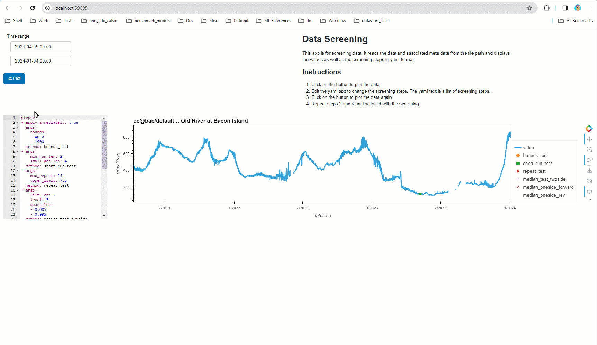

# dms_datastore_ui

Web UI for dms_datastore

Hosted at Azure: https://dwrbdodatastore.azurewebsites.net/repoui


## Command line
```
 dms_datastore_ui -h
Usage: dms_datastore_ui [OPTIONS] COMMAND [ARGS]...

Options:
  -h, --help  Show this message and exit.

Commands:
  data-screener  Show the data screener
  flag-editor    Show the flag editor
  show-repo      Show the station inventory explorer
  version        Print the version of dms_datastore_ui
```

# Data Repository UI

```
 dms_datastore_ui show-repo -h
Usage: dms_datastore_ui show-repo [OPTIONS] REPO_DIR

  Show the station inventory explorer

Options:
  -h, --help  Show this message and exit.
```

[](https://www.youtube.com/watch?v=YlFRzMqWr_M)

# Data Flag Editor
```
dms_datastore_ui flag-editor -h
Usage: dms_datastore_ui flag-editor [OPTIONS] FILEPATH

  Show the flag editor

Options:
  -h, --help  Show this message and exit.
  ```
[](docs/FlagEditorDemo.gif)

# Data Screening Rules Editor
```
dms_datastore_ui data-screener -h
Usage: dms_datastore_ui data-screener [OPTIONS] FILEPATH

  Show the data screener

Options:
  -h, --help  Show this message and exit.
  ```
[](docs/DataScreenerDemo.gif)

